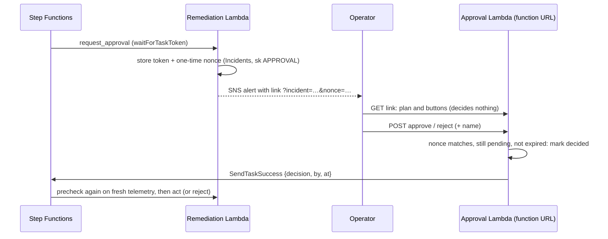

# Guardrails (Step 6)

Automation that acts on physical equipment needs limits. The remediation state machine
(docs/remediation.md) enforces six guardrails; each one is visible in the incident's audit trail.

| Guardrail | Rule | Where | Trail step |
| --- | --- | --- | --- |
| Asset lock | One incident commands an asset at a time | DynamoDB conditional write (Locks) | `precheck_failed` "held by incident …" |
| Human approval | High-risk plans wait for a person; nothing is sent before | Step Functions task token, approval Lambda + function URL | `approval_requested`, `rechecked_after_approval`, `rejected` |
| Recheck after approval | The plan is rebuilt on fresh telemetry before acting | Precheck runs again | `rechecked_after_approval` |
| Rollback | A stage that does not verify is undone (or deliberately held) | Per-stage `rollback` in the playbook | `verify_failed`, `rolled_back` / `rollback_hold` |
| Circuit breaker | 2 failed verifications on an asset disable automation for it (24 h, or until reset) | Guardrails table `breaker#<asset>` | `guardrail_blocked`, `circuit_breaker_opened` |
| Rate limit | At most 3 automated incidents act on an asset per hour | Guardrails table `rate#<asset>` | `guardrail_blocked` |

Everything that cannot pass a guardrail is escalated: a human gets the alert with the reason, and
the incident keeps its assets locked so automation does not retry.

## Approval flow

- **GET never decides.** Mail scanners and link previews open links automatically; only the
  form's POST records a decision.
- **One-time, expiring link.** The nonce is 192 random bits, compared in constant time, accepted
  once while the request is pending, and refused after the wait times out (default 30 min,
  `-c approval_timeout_s=…`). A timed-out wait escalates with "nothing was sent".
- The function URL has no AWS authentication (the nonce is the credential), which suits a
  prototype; a production system would put it behind single sign-on.
- From the shell: `make approvals` lists waiting plans and their links, `make approve I=<id>` /
  `make reject I=<id>` decide through the same Lambda.

## Rollback per playbook

| Playbook | Stage | Rollback |
| --- | --- | --- |
| cooling_unit_failover | boost + start standby | hold: extra cooling cannot make the zone hotter |
| | hand to automatic control | back to the verified boost configuration |
| sensor_quarantine | flag sensor | clear the flag |
| pump_switchover | start standby pump | stop the standby pump (duty pump still runs) |
| | stop degraded pump | restart the degraded pump |
| chilled_water_recovery | lower setpoint + assist | original setpoint, assist off |
| hotspot_mitigation | boost zone CRAH | CRAH back to automatic |
| ups_load_transfer | move load | share the load again |
| rack_power_cap | cap racks | hold: removing caps would raise the load |

Rollback returns the equipment to the last configuration that was verified (or to its state
before the playbook). Where undoing is less safe than keeping the change, the playbook says
"hold" and why; the escalation message carries that reason to the operator.

## Results (offline closed loop, `make playbook-eval`)

5 seeds per fault; high-risk plans approved by a simulated operator after 2 minutes.

| Fault | Outcome | Median time to detect (s) | Median time to verified recovery (s) | Alerts to humans per run |
| --- | --- | --- | --- | --- |
| ups_battery_overheat | 5/5 mitigated after approval | 90 | 240 | 3 (includes the approval request) |
| pdu_overload | 5/5 mitigated after approval | 30 | 180 | 2 (includes the approval request) |

The other six fault types are unchanged from Step 5 (30/30 mitigated with no human input).

Guardrail behaviour tested (`tests/test_guardrails.py`): approved plans are rechecked, then act
and verify, and no command is sent before the answer; rejected plans send nothing; unanswered
requests time out and escalate; a failed stage is rolled back (the hotspot boost is returned to
automatic) and escalated; two failures open the breaker; a fourth incident within an hour is
blocked by the rate limit; approval links show a page on GET, decide on POST, refuse a wrong
nonce (403), a second use (409) and an expired request (410).

## Commands

| Command | What it does |
| --- | --- |
| `make e2e-approval` | Live: UPS 1 overheats, the plan waits, is approved through the function URL, acts and verifies |
| `make approvals` / `make approve I=` / `make reject I=` | Waiting approvals / decide |
| `make guardrails` | Rate-limit and breaker state per asset |
| `make reset-breaker A=crah2` | Close a breaker after the equipment was repaired |
| `make playbook S=ups_battery_overheat O=reject` | Offline run with the simulated operator approving (default), rejecting or not answering (`O=none`) |

CDK context: `-c approval_timeout_s=1800 -c max_actions_per_hour=3 -c breaker_failures=2`.
`tools/prepare_run.py` clears the guardrail state before each run, like the locks.
