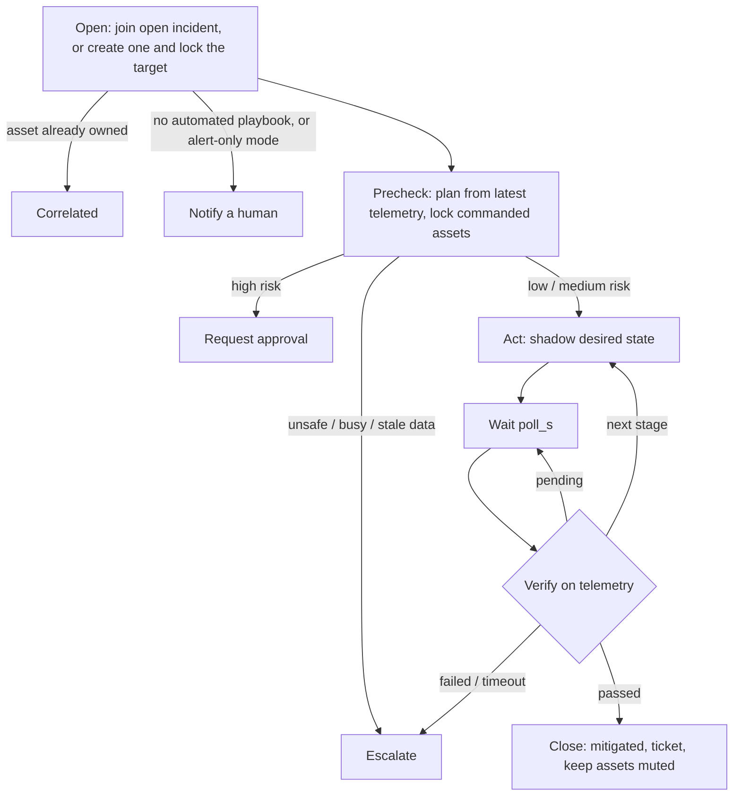

# Remediation playbooks (Step 5)

Every anomaly event starts one execution of the remediation state machine. It either joins an
incident that is already open, alerts a human, or runs a playbook: act through the device shadow,
verify on telemetry, then close or escalate. Every step is written to the Incidents table.

```
Detector ─► EventBridge bus ─► rule ─► Step Functions (Standard): the remediation state machine
                                          │  each step calls the remediation Lambda
                                          ├─► Locks table        (who owns which asset)
                                          ├─► Incidents table    (summary + one item per step)
                                          ├─► SNS alerts topic   (humans)
                                          └─► device shadow desired state
                                                 AWS:   IoT Core UpdateThingShadow
                                                 local: SQS queue ─► bridge ─► MQTT shadow delta
Gateway applies the delta, reports its full state; telemetry shows the effect ─► Verify
```

## The safe pattern (one state machine for all playbooks)



The proposal planned one state machine per playbook family. This design uses one state machine
for all of them and keeps the playbooks as data (`playbooks/catalog.py`), because every family
follows the same pattern. Playbooks are then explainable, testable offline, and easy to add.
Standard workflows are used because Step 6 needs task-token approval waits.

## Playbooks

| Fault | Playbook | Risk | Stages (shadow commands) | Verified when (3 messages in a row, 30 s) |
| --- | --- | --- | --- | --- |
| crah_fan_failure | cooling_unit_failover | low | 1. neighbours' fans 100 %, standby crah5 on in the zone, fan 90 %; 2. neighbours and standby back to automatic | zone inlets ≤ 27 °C and standby on in the zone (stage 2: 6 messages) |
| sensor_stuck / sensor_drift | sensor_quarantine | low | flag the sensor; the gateway publishes it as `quarantined`, the detector ignores it (rack inlet replaced by the zone median) | `quarantined` contains the sensor |
| pump_degradation | pump_switchover | medium | 1. start standby pump; 2. stop degraded pump | standby on with flow; then degraded pump off, flow ≥ 35 L/s, vibration ≤ 4.5 mm/s |
| chw_supply_drift | chilled_water_recovery | medium | setpoint −3 K, assist on | supply ≤ original setpoint + 1 K |
| rack_hotspot | hotspot_mitigation | medium | zone CRAH fan 100 % (ticket asks for a workload move) | rack inlet ≤ 27 °C |
| ups_battery_overheat | ups_load_transfer | high | move the load to the other UPS (after approval) | UPS load ≤ 5 kW, other battery ≤ 35 °C |
| pdu_overload | rack_power_cap | high | cap the zone's racks at 40 kW (after approval) | PDU load ≤ 85 % |
| unexplained | notify_only | – | none: a human is alerted | – |

A stage fails if its checks do not hold within 60 messages (10 simulated minutes).
Preconditions stop a playbook and escalate: standby unit or pump not available, target unit
running again, hotspot in a zone whose CRAH has failed, or telemetry older than 2 minutes.

## Locks and alert grouping

A conditional write on the Locks table is the lock. An incident takes these roles:

| Role | Assets | Events on the asset |
| --- | --- | --- |
| target, source | the diagnosed asset | join the incident |
| commanded | assets the playbook changes | join the incident; no second playbook can command them |
| affected | downstream assets and expected side effects | only *unexplained* events join; a diagnosed fault opens its own incident |
| notified | target of a notify-only incident | unexplained events join; a diagnosed fault **supersedes** the notify incident and takes over its locks |

The downstream scope comes from the physical dependencies (`common/topology.py: downstream`):
the chilled water plant feeds every CRAH and rack; a CRAH its zone and neighbours; a PDU its racks
and CRAH. Without this grouping a pump or chiller fault produced 13–19 separate rack alerts; with
it they join one incident. A slow fault is often first seen as *unexplained* before the diagnosis
rules are sure; superseding lets the playbook still run once the diagnosis arrives.

After closing, locks stay for `MUTE_S` (1 h) so repeated events join the closed incident.
After escalation they stay for `LOCK_S` (2 h): no automated retry, a human takes over.
`make reset-locks` releases everything between experiment runs.

## Preparing a run

`make pipeline-up`, `make e2e` and `make latency` first run `tools/prepare_run.py`:

- **Delete telemetry stamped in the future.** A run at x10 stamps messages up to ten times ahead
  of the wall clock. Left in place, they sort after the next run's messages, and the playbook's
  "latest telemetry" (precheck, verification) would read the old run. A second `make e2e` straight
  after the first failed this way before the step was added.
- **Delete telemetry older than 2 hours** (`--keep-hours`). LocalStack does not expire items by TTL
  promptly; an ever-growing table slowed every DynamoDB call down run after run.
- Release all locks, and drop shadow commands still queued from an earlier run.

## Shadow semantics

The Lambda writes `desired` state per gateway with a `cmd_id` and `issued_at`. After applying a
delta, the gateway reports the asset's **full** controllable state (e.g. `fan_mode`, `fan_pct` or
`null` in automatic). Reporting only the changed key would leave stale values in `reported`, and a
later identical command would produce no delta. `null` in `desired` removes a key.

## Results (offline closed loop, `make playbook-eval`)

Each fault type × 5 seeds (11–15), fault at 600 s. Detection (D2h), state machine, Lambda and
simulator in one process with mocked AWS. Times are simulated seconds after the fault started.

| Fault | Outcome | Median time to detect (s) | Median time to verified recovery (s) | Related events grouped | Alerts to humans per run | Other incidents |
| --- | --- | --- | --- | --- | --- | --- |
| crah_fan_failure | 5/5 mitigated | 30 | 180 | 3 | 1 | 0 |
| sensor_stuck | 5/5 mitigated | 70 | 80 | 0 | 1 | 0 |
| sensor_drift | 5/5 mitigated | 130 | 140 | 1 | 2 | 0 |
| pump_degradation | 5/5 mitigated | 180 | 240 | 27 | 2 | 0 |
| chw_supply_drift | 5/5 mitigated | 90 | 120 | 28 | 2 | 1 |
| rack_hotspot | 5/5 mitigated | 30 | 70 | 3 | 1 | 0 |
| ups_battery_overheat | 5/5 awaiting approval | 90 | – | 0 | 2 | 0 |
| pdu_overload | 5/5 awaiting approval | 30 | – | 0 | 1 | 1 |

- All 30 low/medium-risk runs were fixed and verified with no human input; all 10 high-risk runs
  stopped for approval without sending a command.
- Alerts per run: the "mitigated" notice, plus for slow faults the early "unexplained" alert that the
  diagnosis later superseded. The two other incidents are single unexplained alerts raised before
  the root-cause event arrived.
- Without remediation the same faults stay active: for example the CRAH failure takes zone 2 to
  35–48 °C and the chilled water supply stays around 21 °C (Step 2 scenarios without actions).
- Alert-only mode (`AUTOMATION=notify`, mode M1 in the experiments) sends one alert and no commands.

## Commands

| Command | What it does |
| --- | --- |
| `make deploy-local` | Builds both Lambdas and deploys the Remediation stack too |
| `make e2e` | Live check: CRAH 2 fails, the playbook fixes and verifies it |
| `make incidents` / `make incident I=<id>` | Incident list / one incident's audit trail |
| `make locks` / `make reset-locks` | Show / release asset locks |
| `python -m tools.prepare_run` | Prepare a new run (done automatically by the targets above) |
| `make playbook S=pump_degradation [A=notify]` | One offline closed-loop run, printed step by step |
| `make playbook-eval` | The results table above (about 6 min) |

CDK context options: `-c automation=notify` (alert-only), `-c poll_s=10` (seconds between checks),
`-c shadow_transport=iot|sqs` (default: `sqs` for stage `local`, `iot` otherwise).

## Limitations and Step 6

- The results table above is from Step 5, when high-risk plans stopped at "awaiting approval".
  Step 6 added the approval wait, recheck, rollback, rate limit and circuit breaker; see
  [guardrails.md](guardrails.md) for how they work and the high-risk results after approval.
- Wait times in Step Functions are wall-clock seconds; verification counts telemetry messages, so it
  is independent of the simulator speed.
- Playbook thresholds (27 °C, 35 L/s, …) are taken from ASHRAE and the equipment limits used in the
  simulator; a real site would set them per device.
