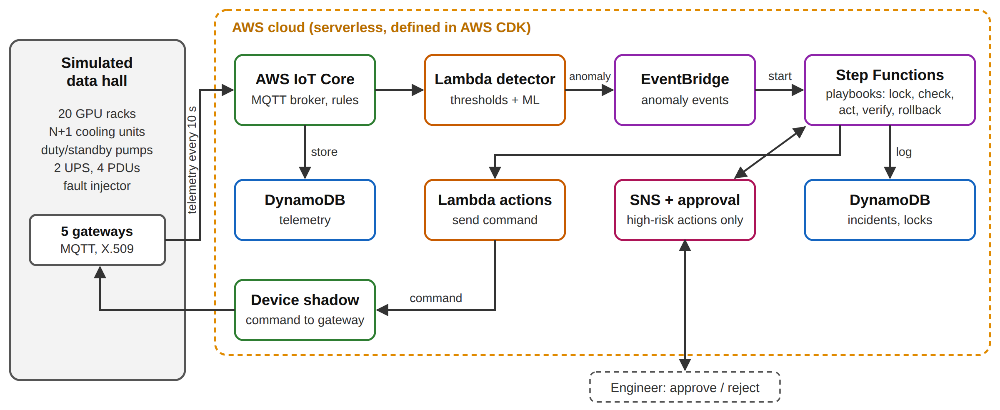

# Self-Healing Data Center Facilities: A Serverless AWS IoT Framework for Anomaly Detection and Automated Remediation of Cooling and Power Faults

Mazharul Islam Tusar · Bachelor's thesis proposal · Savonia University of Applied Sciences · September 2026

## Abstract

Power and cooling failures remain the leading cause of costly data center outages, yet most facilities still respond to them by hand. This thesis will design, build and evaluate a serverless framework on Amazon Web Services (AWS) that turns data center IoT sensor data into safe, automatic corrective action. Telemetry from a simulated 20-rack data hall will stream to AWS IoT Core, where a detector will compare static thresholds with two machine-learning models, and a workflow will run remediation playbooks protected by locks, risk tiers, human approval, verification and rollback. The work will follow Design Science Research and will be evaluated quantitatively in controlled fault-injection experiments that compare alert-only response, threshold-based automation and ML-based automation across eight fault types. Latency, scalability and cost will be measured on real AWS. The expected output is an open-source reference architecture, a reusable safety pattern for physical equipment and measured evidence of where machine learning helps.

## 1 Introduction and problem statement

Outages are becoming rarer but costlier: 57 % of operators report that their latest major outage cost over $100,000, and power and cooling faults remain the main cause (Uptime Institute 2026). Most facilities already collect sensor data, but acting on it remains manual. Four key concepts are used. *IoT telemetry* is the stream of sensor readings sent from equipment to a platform. *Anomaly detection* identifies readings that deviate from normal behaviour. *Serverless* computing runs code only when an event occurs, with no servers to manage. *Self-healing* (automated remediation) means detecting, diagnosing and correcting a fault without waiting for a person.

**Problem statement.** Data center facility operations lack a validated, cloud-native way to go from IoT sensor data to safe, automatic corrective action within seconds. Three gaps cause this: (1) *slow, manual response*, since recovery time depends on staffing; (2) *noisy detection*, since static limits miss slow drifts such as pump wear and raise false alarms during load swings; and (3) *unsafe automation*, since actions on physical equipment can make a fault worse without approval, verification and rollback. The topic is directly relevant to working life, because data center operators and cloud engineers need practical, affordable designs for automated operations, and AWS has retired IoT Analytics, IoT Events and Lookout for Equipment since 2025, leaving no current reference design.

## 2 Research questions and objectives

- **RQ1:** How can a serverless AWS architecture turn data center IoT telemetry into safe, automated remediation?
- **RQ2:** How does ML anomaly detection compare with static thresholds in detection rate, speed and false alarms?
- **RQ3:** How much does automation shorten recovery versus alert-only response, and at what latency, scale and cost?

**Objectives.** O1 (month 1): review the literature and fix measurable targets (table 1). O2 (month 2): build a simulated data hall with eight injectable fault types. O3 (months 2–3): deploy the pipeline on AWS as infrastructure as code, covered by automated tests. O4 (month 3): implement playbooks with safety guardrails. O5 (months 4–5): run the experiments on the simulator and on real AWS, and judge every target.

Table 1. Measurable targets for the evaluation

| Target | Pass criterion |
| --- | --- |
| Faster recovery | Automation recovers faster than alert-only response (Holm-corrected p < 0.05) |
| Better detection | ML detects all eight fault types, and slow-developing faults earlier than thresholds |
| No false or wrong actions | Zero wrong automated actions in all runs; at most two notify-only alerts per day |
| Real-data check | F1 on the SKAB pump dataset at least equal to static thresholds |
| Fast, scalable, affordable | p95 latency ≤ 5 s; ≥ 99.9 % of messages processed at 2,000 gateways; ≤ $1 per rack per month |

## 3 Literature review

**Self-healing systems.** Autonomic computing describes self-healing as a monitor–analyse–plan–execute loop (Kephart & Chess 2003). A recent review of 99 studies finds such loops maturing for containers and cloud services, but notes a validation gap for real deployments (AI-driven self-healing across the edge–cloud continuum 2026). These studies target software, not physical plant.

**AI for facilities.** Facility AI concentrates on saving cooling energy in normal operation, for example with offline reinforcement learning in a production data center (Zhan et al. 2025), rather than on detecting and repairing faults.

**Anomaly detection.** Unsupervised models such as Isolation Forest (Liu, Ting & Zhou 2008) and LSTM autoencoders (Malhotra et al. 2016) catch drifts that fixed limits miss. On the SKAB benchmark, however, they rarely beat simple limits on F1 and often raise more false alarms (Katser & Kozitsin 2020). Whether machine learning is worth its complexity for facilities is therefore still open.

**Cloud IoT.** AWS designs for serverless IoT anomaly detection also stop at alerts rather than actions (Amazon Web Services 2023). No study found combines facility telemetry, ML detection and guarded automatic remediation in a current serverless architecture with measured recovery time, latency and cost.

## 4 Methodology

**Research design.** The thesis follows quantitative Design Science Research (Hevner, March, Park & Ram 2004; Peffers, Tuunanen, Rothenberger & Chatterjee 2007). The framework is the artefact, and it will be evaluated after it is built, in an artificial setting (Venable, Pries-Heje & Baskerville 2016). A simulator is chosen because injecting faults into live equipment is unsafe and a simulator gives exact ground truth.

**Artefact.** A Python simulator will model one hall with 20 GPU racks, N+1 cooling units, duty and standby pumps, two UPS units and four PDUs, whose gateways publish telemetry every 10 seconds. The data will flow through AWS IoT Core to storage and a detector. Confirmed anomalies will start guarded playbooks in AWS Step Functions, and the resulting commands will return to the equipment through device shadows. (Figure 1.)

Figure 1. Proposed serverless AWS IoT architecture

**Data collection.** Data will come from three sources: (1) controlled experiments with eight fault types × three modes (alert-only with a simulated human response, thresholds with automation, ML with automation) × 20 repetitions, plus runs with load surges, faulty sensors and 5–20 % message loss; (2) the public SKAB pump dataset; and (3) timestamps, load tests at 50, 500 and 2,000 gateways, and the measured bill from real AWS. Detectors will be trained on normal data only, with all settings fixed before the final runs.

**Analysis.** Results will be reported as medians with 95 % bootstrap confidence intervals, and the modes compared per fault type with Holm-corrected Mann–Whitney U tests and effect sizes. Detection will be measured with F1 and false- and missed-alarm rates, and latency with p50, p95 and p99.

**Reliability, ethics and use of AI.** Only simulated and public data are used, with no personal data. Code, seeds and results will be published, and the limits of a simulated plant stated openly. Claude Code, an AI assistant, is used for programming support and language editing (Anthropic 2026). AI-assisted code will be checked with automated tests and AI-assisted text reviewed by the author, and this use will be reported and evaluated in the thesis.

## 5 Significance and contribution

The thesis moves self-healing from the IT layer to the physical facility layer. It will contribute (1) an open-source serverless reference architecture that deploys with one command and uses only supported AWS services; (2) a reusable safety pattern for automating physical equipment (locks, risk tiers, approval, verification, rollback and a circuit breaker); (3) statistically tested evidence on recovery time, latency, scalability and cost that operators can compare against; and (4) an honest account of where machine learning helps and where simple limits are enough. The work also builds the author's expertise in cloud architecture, IoT and applied machine learning.

## References

AI-driven self-healing across the edge–cloud continuum: a systematic literature review 2026. Information and Software Technology. https://www.sciencedirect.com/science/article/pii/S0950584926002211. Accessed 30.9.2026.

Amazon Web Services 2023. Streamlining agriculture operations with serverless anomaly detection using AWS IoT. Internet publication. AWS IoT Blog. https://aws.amazon.com/blogs/iot/serverless-iot-anomaly-detection/. Accessed 30.9.2026.

Anthropic 2026. Claude Code. AI assistant. Used for programming support and language editing, 2026. https://claude.ai/code.

Hevner, A. R., March, S. T., Park, J. & Ram, S. 2004. Design science in information systems research. MIS Quarterly 28 (1), 75–105.

Katser, I. D. & Kozitsin, V. O. 2020. Skoltech Anomaly Benchmark (SKAB). Internet publication. https://github.com/waico/SKAB. Accessed 30.9.2026.

Kephart, J. O. & Chess, D. M. 2003. The vision of autonomic computing. Computer 36 (1), 41–50.

Liu, F. T., Ting, K. M. & Zhou, Z.-H. 2008. Isolation forest. In Proceedings of the 8th IEEE International Conference on Data Mining. Pisa: IEEE, 413–422.

Malhotra, P., Ramakrishnan, A., Anand, G., Vig, L., Agarwal, P. & Shroff, G. 2016. LSTM-based encoder-decoder for multi-sensor anomaly detection. arXiv:1607.00148. https://arxiv.org/abs/1607.00148. Accessed 30.9.2026.

Peffers, K., Tuunanen, T., Rothenberger, M. A. & Chatterjee, S. 2007. A design science research methodology for information systems research. Journal of Management Information Systems 24 (3), 45–77.

Uptime Institute 2026. Annual outage analysis 2026. Internet publication. https://intelligence.uptimeinstitute.com/resource/annual-outage-analysis-2026. Accessed 30.9.2026.

Venable, J., Pries-Heje, J. & Baskerville, R. 2016. FEDS: a framework for evaluation in design science research. European Journal of Information Systems 25 (1), 77–89.

Zhan, X., Zhu, X., Cheng, P., Hu, X., He, Z., Geng, H., Leng, J., Zheng, H., Liu, C., Hong, T., Liang, Y., Liu, Y. & Zhao, F. 2025. Data center cooling system optimization using offline reinforcement learning. In Proceedings of the 13th International Conference on Learning Representations (ICLR 2025). https://arxiv.org/abs/2501.15085. Accessed 30.9.2026.
