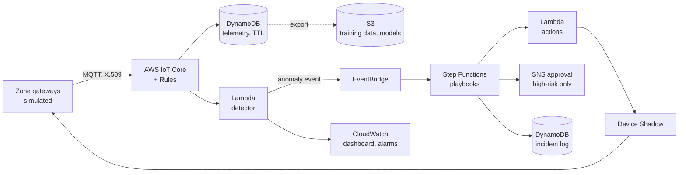
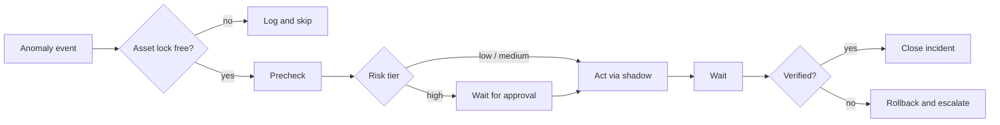
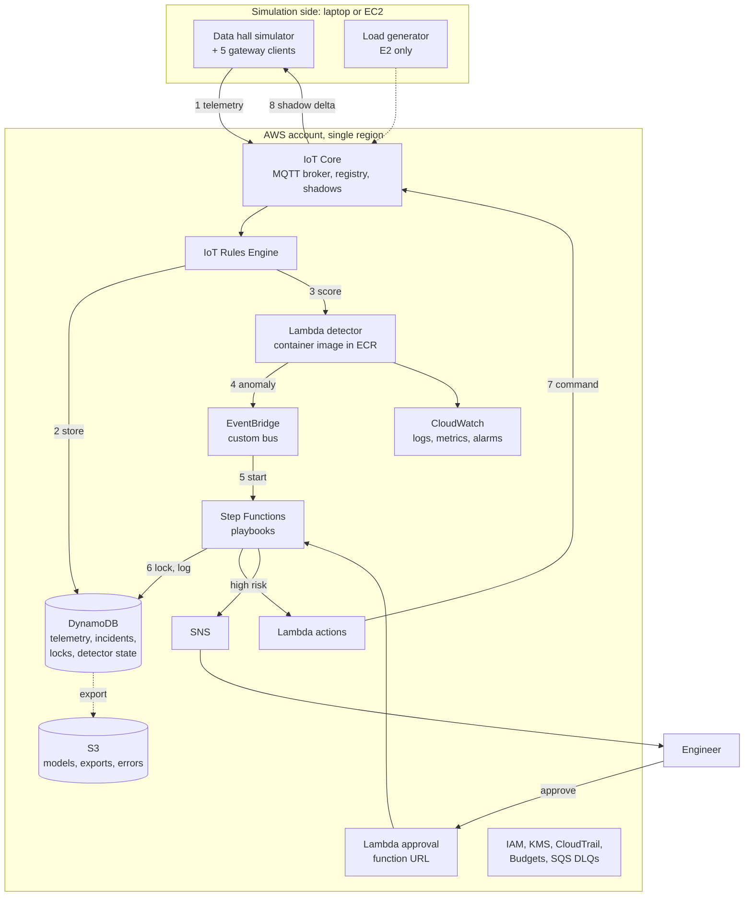

# Research Proposal: A Serverless AWS IoT Framework for Automated Anomaly Detection and Remediation in Data Center Infrastructure

Sep 24, 2026 · @Mazharul Islam Tusar

## Thesis details

| Item | Detail |
| --- | --- |
| Working title | A Serverless AWS IoT Framework for Automated Anomaly Detection and Remediation in Data Center Infrastructure |
| Short title | Self-healing data center facilities on AWS IoT |
| Degree | Bachelor's degree |
| University / programme | Savonia University of Applied Sciences; programme *to be added* |
| Supervisor / advisor | *To be added* |
| Duration | 6 months full-time |
| Keywords | Data center, IoT, AWS IoT Core, serverless, event-driven automation, anomaly detection, auto-remediation, self-healing, digital twin |

## Abstract

This thesis will design, build and evaluate a serverless framework on Amazon Web Services (AWS) that uses IoT telemetry to detect faults in data center cooling and power equipment and fix them automatically.

Data center facilities depend on cooling units, pumps, power distribution and UPS systems. When one of them drifts or fails, operators today are usually alerted and then respond by hand. This delay increases the risk of overheating, throttling and downtime, especially in dense AI racks.

The proposed framework streams sensor data from a simulated data hall through AWS IoT Core. Machine learning models detect anomalies, and an event-driven workflow built with Amazon EventBridge, AWS Step Functions and AWS Lambda executes remediation playbooks. Examples include raising fan speed, switching to a redundant cooling unit or adjusting setpoints. High-risk actions require human approval, and every action is verified and can be rolled back.

The framework will be tested with injected faults and compared with static-threshold alerting and manual response. Evaluation covers detection accuracy, time to detect, time to recover, end-to-end latency, scalability and monthly AWS cost. The expected result is a reusable, open-source reference architecture for self-healing data center facilities on AWS.

## 1. Introduction and background

Data center outages are becoming rarer but more expensive, and power and cooling failures remain their main cause, which makes fast automated response valuable.

### 1.1 Why facility failures matter

Uptime Institute's 2026 analysis finds that outage frequency per site has fallen for five years, but costs keep rising. 57% of operators said their latest major outage cost more than $100,000, and one in five said more than $1 million ([Uptime Institute, 2026](https://intelligence.uptimeinstitute.com/resource/annual-outage-analysis-2026)).

Power is still the leading cause of impactful outages, dominated by failures of UPS systems, transfer switches and generators. Uptime also reports that operators are shifting investment toward automation and control systems to manage growing complexity (same source). For AI racks, even a brief cooling interruption can force GPUs to throttle or shut down ([TechRepublic, 2026](https://www.techrepublic.com/article/news-data-center-outages-decline-costs-rise/)).

### 1.2 From monitoring to self-healing

Most facilities already collect sensor data through building management or DCIM systems, but the response is still largely manual. An alert fires, an engineer investigates, and then acts. Industry surveys show a move toward "self-healing" operations: about a third of IT teams report using auto-remediation tools that trigger predefined fixes ([Nokia / Futurum, 2025](https://www.nokia.com/blog/automate-everything-how-data-centers-are-embracing-aiops-and-automation/)).

### 1.3 Why cloud IoT and serverless

Cloud IoT platforms such as AWS IoT Core offer secure device connectivity, rules-based routing and pay-per-use serverless compute. An event-driven design, where each sensor message or anomaly triggers the next step, fits remediation well: it reacts in seconds and costs little when nothing is wrong.

The AWS IoT portfolio has also changed quickly. AWS IoT Analytics reached end of support on 15 December 2025 ([AWS](https://docs.aws.amazon.com/iotanalytics/latest/userguide/iotanalytics-end-of-support.html)), AWS IoT Events on 20 May 2026 ([AWS](https://aws.amazon.com/iot-events/)), and Amazon Lookout for Equipment ends on 7 October 2026 ([AWS](https://aws.amazon.com/lookout-for-equipment)). A current, well-justified architecture built on core services is therefore a practical contribution in itself.

## 2. Problem statement

Data center facility operations lack a validated, cloud-native way to go from IoT sensor data to safe, automatic corrective action within seconds.

Three gaps drive this problem:

- **Slow, manual response.** Static threshold alarms notify people, who then diagnose and act. Time to recover depends on staffing and procedures, and Uptime notes that failure to follow procedures is a growing cause of outages.
- **Noisy detection.** Fixed thresholds miss slow drifts, such as a degrading pump, and raise false alarms during normal load swings.
- **Unsafe or untested automation.** Automatic actions on physical equipment can make things worse. Operators need guardrails: approval steps, verification and rollback.

Self-healing research focuses mainly on the IT layer, such as containers, virtual machines and microservices. The facility layer (cooling and power equipment, observed through IoT sensors) has received far less attention, especially with current serverless cloud services.

## 3. Aim, objectives and research questions

**Aim:** to design, implement and evaluate a serverless AWS IoT framework that automatically detects and safely remediates anomalies in data center cooling and power infrastructure.

### 3.1 Objectives

1. Review research and industry practice on data center monitoring, IoT cloud architectures, anomaly detection and self-healing operations.
2. Build a simulated data hall that produces realistic IoT telemetry, supports fault injection and responds to control commands.
3. Implement an event-driven AWS pipeline for ingestion, storage, anomaly detection and remediation, deployed as infrastructure as code.
4. Design remediation playbooks with safety guardrails: preconditions, human approval for high-risk actions, verification and rollback.
5. Evaluate the framework against threshold alerting and manual response on detection, recovery, latency, scalability and cost.

### 3.2 Research questions

- **RQ1:** How can a serverless AWS architecture be designed to turn data center IoT telemetry into safe, automated remediation actions?
- **RQ2:** How does ML-based anomaly detection compare with static thresholds in detection accuracy and time to detect for typical cooling and power faults?
- **RQ3:** How much does automated remediation reduce time to recover compared with alert-only manual response, and at what end-to-end latency, scalability and monthly cost?

## 4. Literature review and research gap

Self-healing automation is well studied for IT software, and AI is well studied for optimizing data center cooling, but cloud-native automated remediation of facility equipment sits between the two and is little studied.

### 4.1 Self-healing and closed-loop remediation (IT layer)

A 2026 systematic review describes self-healing systems across the edge–cloud continuum that detect, diagnose and remediate faults with minimal human supervision ([SLR, 2026](https://www.sciencedirect.com/science/article/pii/S0950584926002211)). Example frameworks use autoencoders on CPU, memory and latency telemetry and then restart containers automatically ([Zenodo, 2026](https://zenodo.org/records/19899740)). Industry platforms stress governed remediation: policy guardrails, verification and rollback ([LogicMonitor, 2026](https://www.logicmonitor.com/blog/automation-aiops-self-healing-autonomous-it)). These works target software services, not physical cooling or power equipment.

### 4.2 AI for data center facility operations

Facility AI research focuses on continuous optimization, mainly of cooling energy. Examples include offline RL deployed in a production data center ([Zhan et al., 2025](https://arxiv.org/pdf/2501.15085)) and simulator-based RL at Meta ([Meta, 2024](https://engineering.fb.com/2024/09/10/data-center-engineering/simulator-based-reinforcement-learning-for-data-center-cooling-optimization/)). Physical-AI and digital-twin approaches for data center operations are also emerging ([Cao et al., 2025](https://arxiv.org/pdf/2504.04982)). These works optimize normal operation rather than detect and repair faults.

### 4.3 Cloud IoT and serverless anomaly detection

AWS documents serverless anomaly detection built from IoT Core, SQS and Lambda, but it ends in alerts rather than actions ([AWS IoT blog, 2023](https://aws.amazon.com/blogs/iot/serverless-iot-anomaly-detection/)). AWS IoT SiteWise added built-in multivariate anomaly detection in July 2025 ([AWS, 2025](https://aws.amazon.com/about-aws/whats-new/2025/07/aws-iot-sitewise-multivariate-anomaly-detection/)). Research also notes that serverless systems bring their own reliability issues, such as silent failures ([arXiv, 2025](https://arxiv.org/pdf/2507.04969)).

### 4.4 Gap summary

| Work | Target layer | Detection | Automatic action | Safety guardrails | Cloud IoT pipeline |
| --- | --- | --- | --- | --- | --- |
| Self-healing SLR (2026) | IT / edge–cloud | ML | Yes | Discussed | No |
| Autoencoder self-healing (2026) | Containers | Autoencoder | Restart, rate-limit | Limited | No |
| AWS serverless anomaly detection (2023) | Farm sensors | Statistical | Alerts only | No | Yes |
| Offline RL cooling (2025) | Facility cooling | Not the focus | Continuous control | Constraints | No |
| **This thesis** | **Facility cooling and power** | **ML vs. thresholds** | **Remediation playbooks** | **Approval, verify, rollback** | **Yes, AWS serverless** |

**Research gap:** no work found combines IoT telemetry from data center cooling and power equipment, ML anomaly detection, and guarded automatic remediation in a current serverless cloud architecture, with measured recovery time, latency and cost. The table reflects this author's reading and should be checked in Scopus or IEEE Xplore before submission.

## 5. Scope and delimitations

The thesis builds a working cloud system on real AWS services, while the data center equipment it monitors and controls is simulated in software.

**In scope**

- A simulated data hall of about 20 racks with cooling units, pumps, UPS and power distribution, publishing telemetry as virtual IoT devices
- A fault injection module covering typical cooling, power and sensor faults
- An AWS pipeline: device connectivity, rules-based routing, storage, dashboards, anomaly detection and remediation workflows
- Lightweight ML anomaly detection compared with static thresholds
- Remediation playbooks with risk tiers, human approval, verification and rollback
- Infrastructure as code, security basics (device certificates, least-privilege access) and cost measurement

**Out of scope**

- Physical hardware or connection to a real building management system
- Other clouds (Azure, Google Cloud); portability is discussed but not built
- IT-layer remediation such as VM or container restarts
- Energy optimization or reinforcement learning control
- Deep learning research beyond the chosen detection models
- Formal certification or compliance audits

## 6. Methodology

The thesis follows Design Science Research: build the framework as an artifact, demonstrate it on a simulated data hall, and evaluate it through controlled fault-injection experiments.

### 6.1 Research design

The work follows the six Design Science Research steps of Hevner et al. (2004) and Peffers et al. (2007).

| DSR step | Activity in this thesis | Thesis chapter |
| --- | --- | --- |
| 1. Identify problem | Outage data, manual response, gaps in literature | 1–2 |
| 2. Define objectives | Requirements: detect, act safely, low latency, low cost | 3 |
| 3. Design and develop | Architecture, simulator, detectors, playbooks | 3–4 |
| 4. Demonstrate | Closed-loop runs on injected faults | 5 |
| 5. Evaluate | Experiments E1–E4, comparison of M1–M3 | 6 |
| 6. Communicate | Thesis, open-source repository, optional paper | 7–8 |

### 6.2 System architecture

The architecture is designed to run almost entirely inside the AWS Free Tier and always-free limits, using only actively supported services.



Telemetry flows from the gateways through IoT Core rules to storage and the detector; remediation commands return to the gateways through device shadows, closing the loop.

| AWS service | Role | Free Tier / cost note |
| --- | --- | --- |
| AWS IoT Core | MQTT connectivity, rules, device shadows | Monthly free allowance for messages, connection minutes and shadow operations in the first year |
| AWS Lambda | Detector, actions, approval callback | Always-free monthly allowance |
| Amazon DynamoDB | Telemetry (30-day TTL), incident and lock tables | Always-free capacity covers test scale |
| Amazon EventBridge | Routes anomaly events to playbooks | Negligible at test scale |
| AWS Step Functions | Playbooks: precheck, approval, act, verify, rollback | Small free allowance; cents beyond |
| Amazon SNS | Human approval and notifications | Free allowance for email |
| Amazon S3 | Exported training data, model files | Low cost |
| Amazon CloudWatch | Logs, metrics, dashboard, alarms | Basic dashboards and alarms at low cost |
| AWS CDK | Infrastructure as code | Free |

Two changes from the initial design keep costs down. Kinesis Data Streams is replaced by direct IoT rule actions, and Timestream for InfluxDB, which has no free tier and bills per instance hour, is replaced by DynamoDB with automatic expiry. Retired services (IoT Analytics, IoT Events, Lookout for Equipment) are avoided.

### 6.3 Data sources

The thesis combines a controllable simulator with real public data, because real fault data from data center facilities is rarely published.

| Dataset | Type | Role in the thesis |
| --- | --- | --- |
| Simulator telemetry with fault labels | Synthetic, labelled | Main data for all closed-loop experiments |
| Skoltech Anomaly Benchmark (SKAB) | Real pump testbed, labelled | External validation of detectors (RQ2) |
| Alibaba GPU cluster trace (2020) | Real GPU workload | Realistic IT load that drives heat in the simulator |
| Frontier supercomputer energy dataset (Sun et al., 2024) | Real liquid cooling telemetry | Optional calibration of normal cooling behaviour |
| ASHRAE thermal guidelines | Standard | Temperature limits for thresholds and verification |

Detectors are trained only on normal simulator data (unsupervised); injected faults are used only for testing. SKAB is used with its published train/test split.

### 6.4 Simulated data hall

A Python simulator models one data hall split into four zones plus a plant area.

| Component | Count | Telemetry | Commands accepted |
| --- | --- | --- | --- |
| GPU rack | 20 (5 per zone) | Inlet and outlet temperature, power | Power cap (simulated) |
| Cooling unit | 4 active + 1 standby (N+1) | Supply and return temperature, fan speed, status | Fan speed, on/off, setpoint |
| Pump | 1 duty + 1 standby | Flow, differential pressure, vibration, motor current | On/off |
| UPS | 2 | Load, battery temperature, battery voltage | Load transfer |
| PDU | 4 (one per zone) | Power, current | None |

**Thermal model:** each zone uses a lumped energy balance, where zone temperature rises with IT heat and falls with cooling capacity:

```latex
C_z \frac{dT_z}{dt} = P_{IT,z}(t) - \dot{m}_z \, c_p \, \big(T_{return,z} - T_{supply,z}\big)
```

The model steps every second, adds Gaussian sensor noise, and drives IT power from the scaled GPU trace.

**Gateways:** four zone gateways and one plant gateway each publish one batched JSON message every 10 seconds, mirroring how real facilities aggregate sensors. This keeps the message count within Free Tier limits (see 7.10).

**Fault injection:** each scenario sets fault type, start time, severity and shape (abrupt step, gradual ramp, or stuck value). Ground-truth labels are logged locally and never sent to the cloud, so detectors cannot see them.

| Fault | Shape | Symptom in telemetry | Remediation playbook | Risk tier |
| --- | --- | --- | --- | --- |
| Cooling unit fan failure | Step | Zone inlet temperatures rise | Raise neighbour fan speed; start standby unit | Low |
| Sensor stuck or drifting | Stuck / ramp | Flat or implausible readings | Flag sensor, exclude from decisions, open ticket | Low |
| Pump degradation | Ramp | Flow falls; vibration and current rise | Switch to standby pump; open ticket | Medium |
| Coolant supply temperature drift | Ramp | Supply above setpoint | Adjust setpoint; start standby capacity | Medium |
| Rack hotspot | Step | One rack inlet above limit | Boost local cooling; request workload move (simulated) | Medium |
| UPS battery overheating | Ramp | Battery temperature rise | Transfer load to second UPS | High (approval) |
| PDU power near limit | Step | Power close to rating | Cap rack power (simulated) | High (approval) |

### 6.5 Anomaly detection design

Detection turns each gateway message into per-asset features, scores them, and emits an anomaly event only when the score stays high.

- **Features:** 60-second rolling statistics per sensor, rates of change, and cross-sensor residuals (for example, pump current vs. flow, rack inlet vs. zone supply temperature).
- **D0 – Thresholds (baseline):** ASHRAE recommended inlet range and equipment limits.
- **D1 – Isolation Forest:** scikit-learn model, small enough to run in Lambda.
- **D2 – LSTM autoencoder:** trained in PyTorch, exported to ONNX and run with ONNX Runtime in a Lambda container image.
- **Decision rule:** an asset is anomalous when its score exceeds the 99.5th percentile of validation scores for k consecutive windows (k tuned, e.g. 3). This debouncing reduces false alarms.
- **Fault mapping:** a transparent rule table maps the anomalous asset and sensor group to a fault type and its playbook, so every action can be explained.

### 6.6 Remediation design

Each playbook family is a Step Functions state machine following the same safe pattern:



| Guardrail | Implementation |
| --- | --- |
| One playbook per asset | DynamoDB conditional write acts as a lock |
| Rate limit | Maximum actions per asset per hour, checked in precheck |
| Circuit breaker | Two failed verifications disable automation for that asset and escalate |
| Human approval | Step Functions task token, SNS email, Lambda function URL to approve or reject |
| Idempotency | Unique command ID in every shadow update |
| Audit trail | Every state transition logged to the incident table |

### 6.7 Operating modes compared

1. **M1 – Alert only:** threshold alarms plus a simulated human response delay. The delay distribution is an assumption and is varied in sensitivity tests.
2. **M2 – Threshold + automation:** D0 detection with automatic playbooks.
3. **M3 – ML + automation (proposed):** D1 or D2 detection with automatic playbooks.

Comparing M1 with M2 isolates the effect of automation; comparing M2 with M3 isolates the effect of ML detection.

### 6.8 Evaluation metrics

Every message and action carries a UTC timestamp, so all times are computed from logs rather than estimated.

| Metric | Definition | How measured | Unit |
| --- | --- | --- | --- |
| Precision, recall, F1 | Detection quality per fault episode | Detector events vs. local ground truth | – |
| Time to detect (MTTD) | Fault start to anomaly event | Ground truth vs. detector log | s |
| Time to recover (MTTR) | Fault start to values back in normal range | Simulator log | min |
| Thermal exposure | Time-integrated excess over temperature limit | Simulator log | K·min |
| End-to-end latency | Sensor timestamp to command received, p50 and p95 | Message and shadow timestamps | ms |
| False remediation rate | Actions with no real fault | Incident log vs. ground truth | % |
| Scalability | Devices supported before p95 latency degrades | Load test logs | devices |
| Monthly cost | Measured and projected AWS cost | Cost Explorer with tags; Pricing Calculator | $/month |

### 6.9 Experiments

- **E1 – Fault response:** 7 fault types × 20 injections × 3 modes = 420 runs of about 15 minutes each.
- **E2 – Scalability and latency:** a separate load generator runs 50, 500, 2,000 and 10,000 virtual devices for 30 minutes each.
- **E3 – Cost:** measured cost at test scale, projected to small, medium and large facilities.
- **E4 – Robustness:** normal load surges (false-alarm stress), faulty sensors, and 5–20% dropped messages.

**Statistical analysis:** results are reported as median and 95% confidence intervals; modes are compared with the Mann–Whitney U test, since recovery times are unlikely to be normally distributed.

### 6.10 Threats to validity

- **External validity:** simulated equipment may behave differently from real equipment; mitigated by literature-based parameters and SKAB validation.
- **M1 baseline:** the human delay is assumed; mitigated by sensitivity analysis over a range of delays.
- **Single cloud:** results are specific to AWS; portability is discussed but not tested.
- **Researcher bias:** fault scenarios and thresholds are fixed before final runs and published with the code.

## 7. Implementation plan

The framework will be built in eight phases, each ending with a concrete test, so that a working system exists at every stage.

### 7.1 Development environment

| Tool | Purpose |
| --- | --- |
| Python 3.12 | Simulator, Lambda functions, experiments, analysis |
| AWS IoT Device SDK v2 for Python | MQTT connection and device shadows for simulated gateways |
| AWS CDK v2 (Python) | Infrastructure as code for all AWS resources |
| scikit-learn, PyTorch, ONNX Runtime | Detector training and lightweight inference |
| boto3, AWS CLI | Scripting, data export, experiment control |
| Docker | Lambda container images |
| pytest, GitHub Actions | Unit tests, `cdk synth` checks on every push |
| Jupyter, pandas, matplotlib | Result analysis and figures |

### 7.2 AWS solution architecture

The solution is a serverless, event-driven design in one AWS account and one region, following the AWS Well-Architected Framework and sized to stay within Free Tier and always-free limits.

**Design principles**

- **Serverless first:** no servers to patch, and nothing costs money while the simulator is idle.
- **Event-driven:** each message or anomaly triggers the next step, which keeps latency low.
- **Fail safe:** if any automation step fails, the system escalates to a human instead of guessing.
- **Least privilege:** every device, function and workflow gets only the permissions it needs.
- **Everything as code:** all resources are defined in AWS CDK and can be rebuilt or destroyed in minutes.

**Deployment view**



**Request flow**

1. Each gateway publishes a batched telemetry message every 10 seconds over MQTT (TLS, X.509 certificate).
2. An IoT rule writes the message to the DynamoDB telemetry table (30-day expiry).
3. A second IoT rule invokes the detector Lambda with the same message.
4. When an asset stays anomalous for k windows, the detector puts an `AnomalyDetected` event on EventBridge.
5. An EventBridge rule starts the matching Step Functions playbook.
6. The playbook takes the asset lock and logs every step to the incident table.
7. For low and medium risk, the action Lambda updates the gateway's device shadow; for high risk, SNS emails an engineer first and the playbook waits for approval.
8. The simulator receives the shadow delta, applies the command and reports its new state; the playbook then verifies recovery and closes the incident or rolls back.

**Security design**

| Layer | Control |
| --- | --- |
| Device identity | One X.509 certificate per gateway; IoT policy limited to its own topic and shadow using the thing-name policy variable |
| Compute | Separate IAM role per Lambda and per state machine, with only the actions it needs |
| Data | DynamoDB and S3 encrypted at rest with AWS-managed KMS keys; MQTT and HTTPS use TLS |
| Deployment | GitHub Actions assumes an IAM role through OIDC, so no long-lived access keys exist |
| Approval link | Function URL accepts only a valid, single-use Step Functions task token that expires with the timeout |
| Audit | CloudTrail for management events; incident table for every automated action |

**Reliability design**

- IoT rule error actions send failed messages to S3, so no data is silently lost.
- Lambda functions use SQS dead-letter queues for failed asynchronous invocations.
- Step Functions tasks have retries with back-off and a catch-all path that escalates to SNS.
- A CloudWatch alarm fires if a gateway stops sending telemetry for 60 seconds, so a silent pipeline failure is noticed.
- Commands carry a unique ID, so a retried command is never applied twice.

**Well-Architected mapping**

| Pillar | How the design addresses it |
| --- | --- |
| Operational excellence | Infrastructure as code, CI checks, dashboards, runbook in the repository |
| Security | Per-device certificates, least-privilege IAM, encryption, OIDC deployment, audit trail |
| Reliability | Dead-letter queues, retries, heartbeat alarms, fail-safe escalation |
| Performance efficiency | Event-driven path with no polling; lightweight models suited to Lambda |
| Cost optimization | Always-free services, batching at gateways, stacks destroyed between experiments |
| Sustainability | No idle servers; resources exist only while experiments run |

**Region and tagging:** one region is used for everything (for example `eu-north-1` Stockholm or `us-east-1`), after checking that every service below is available there. All resources carry the tags `Project=dc-selfheal`, `Stage` and `Experiment`, which lets Cost Explorer report cost per experiment for E3.

### 7.3 AWS service list

**Core services (required)**

| # | Service | Category | Used for | Cost note |
| --- | --- | --- | --- | --- |
| 1 | AWS IoT Core (registry, Rules Engine, Device Shadow) | IoT | Device identity, MQTT ingestion, routing, commands | Monthly free allowance in first year |
| 2 | AWS Lambda | Compute | Detector, actions, approval callback | Always-free allowance |
| 3 | Amazon ECR | Containers | Detector container image (ONNX Runtime, scikit-learn) | Small storage cost |
| 4 | Amazon EventBridge | Integration | Anomaly event bus and routing rules | Negligible at test scale |
| 5 | AWS Step Functions (Standard workflows) | Orchestration | Playbooks; Standard is needed for task-token approval waits | Small free allowance; cents beyond |
| 6 | Amazon DynamoDB | Database | Telemetry, incidents, locks, detector state | Always-free capacity covers test scale |
| 7 | Amazon S3 | Storage | Models, training exports, IoT error archive | Low cost |
| 8 | Amazon SNS | Messaging | Approval emails and alerts | Free email allowance |
| 9 | Amazon SQS | Messaging | Dead-letter queues | Free request allowance |
| 10 | Amazon CloudWatch | Monitoring | Logs, metrics, dashboard, heartbeat alarms | Low cost |
| 11 | AWS IAM | Security | Roles and policies, GitHub OIDC | Free |
| 12 | AWS KMS | Security | Encryption at rest with AWS-managed keys | No charge for AWS-managed keys |
| 13 | AWS CloudTrail | Governance | Audit of management events | One trail of management events is free |
| 14 | AWS CloudFormation (via AWS CDK) | Deployment | Creating and destroying all stacks | Free |
| 15 | AWS Budgets and Cost Explorer | Cost management | Spending alerts and per-experiment cost (E3) | Free at this scale |

**Optional services**

| # | Service | Used for | When |
| --- | --- | --- | --- |
| 16 | Amazon EC2 | Running the load generator for E2 close to AWS | Only if the laptop cannot generate 10,000 devices |
| 17 | AWS X-Ray | Tracing latency across Lambda and Step Functions | If a detailed latency breakdown is needed |
| 18 | Amazon Athena | SQL analysis of exported data in S3 | During result analysis |
| 19 | AWS IoT SiteWise | Managed anomaly detection as an extra comparison | Only if time allows |

**Deliberately not used**

| Service | Reason |
| --- | --- |
| Kinesis Data Streams | No free tier; direct IoT rules are enough at this scale |
| Timestream for InfluxDB | Instance-based billing with no free tier |
| Timestream for LiveAnalytics | Closed to new customers since June 2025 |
| AWS IoT Analytics, IoT Events, Lookout for Equipment | Retired or retiring |
| Amazon Managed Grafana | Paid per user; CloudWatch dashboards are sufficient |
| SageMaker real-time endpoints | Always-on cost; models run inside Lambda instead |

### 7.4 Repository structure

```
dc-selfheal/
├── simulator/          # data hall model, gateways, fault injector
│   ├── model.py        # thermal and electrical model
│   ├── gateway.py      # MQTT publishing, shadow handling
│   ├── faults.py       # fault types and injection shapes
│   └── scenarios/      # YAML scenario files for experiments
├── detection/          # feature code, training notebooks, model export
├── lambdas/
│   ├── detector/       # scores telemetry, emits anomaly events
│   ├── actions/        # prechecks, shadow commands, verification
│   └── approval/       # approve/reject callback for high-risk actions
├── playbooks/          # Step Functions definitions (ASL)
├── infra/              # CDK app and stacks
├── experiments/        # scenario runner, load generator, analysis
└── docs/               # architecture diagrams, runbook
```

### 7.5 MQTT topics and message format

Each gateway is one AWS IoT thing with its own certificate and may only publish to its own topic and update its own shadow.

| Purpose | Topic |
| --- | --- |
| Telemetry | `dc/hall1/{gateway}/telemetry` |
| Commands (desired state) | `$aws/things/{gateway}/shadow/update` |
| Command results (reported state) | `$aws/things/{gateway}/shadow/update` (reported section) |

Example telemetry message from a zone gateway:

```json
{
  "gw": "zone2",
  "ts": "2026-12-01T10:15:30.120Z",
  "seq": 18342,
  "assets": {
    "rack07": {"t_in": 24.8, "t_out": 38.2, "p_kw": 41.5},
    "crah2":  {"t_sup": 18.1, "t_ret": 31.6, "fan_pct": 62, "status": "on"},
    "pdu2":   {"p_kw": 205.3, "i_a": 298.0}
  }
}
```

Example remediation command written by the action Lambda:

```json
{
  "state": {
    "desired": {
      "crah3": {"fan_pct": 85},
      "cmd_id": "inc-0412-a1",
      "issued_at": "2026-12-01T10:15:41.870Z"
    }
  }
}
```

### 7.6 AWS resources by stack

| CDK stack | Main resources |
| --- | --- |
| IotStack | 5 IoT things, certificates, least-privilege IoT policy, topic rules (to DynamoDB, to detector Lambda, errors to CloudWatch) |
| DataStack | DynamoDB telemetry table (key: asset, timestamp; 30-day TTL), incident table, lock table, S3 bucket for exports and models |
| DetectionStack | Detector Lambda (container image), EventBridge custom event bus and rules |
| RemediationStack | Step Functions state machines per playbook family, action Lambda, approval Lambda with function URL, SNS topic |
| ObservabilityStack | CloudWatch dashboard, alarms, AWS Budgets alerts, cost-allocation tags |

The whole system deploys with `cdk deploy --all` and is removed with `cdk destroy --all` after each experiment batch, which keeps idle costs near zero.

### 7.7 Build phases

| Phase | What is built | Done when | Month |
| --- | --- | --- | --- |
| P1 – Foundations | AWS account, budgets, repository, CI, empty CDK app | `cdk deploy` succeeds from CI | 1 |
| P2 – Offline simulator | Thermal model, assets, fault injector, plots | Each fault produces its expected symptoms offline | 2 |
| P3 – Connectivity | Gateways on IoT Core, rules to DynamoDB, dashboard | Live telemetry from all 5 gateways visible in CloudWatch | 2 |
| P4 – Detection | Feature code, D0–D2 trained offline, detector Lambda | An injected fan failure produces an anomaly event on EventBridge | 3 |
| P5 – Remediation | Playbooks, action Lambda, shadow commands, simulator obeys | A fan failure is fixed and verified with no human input | 4 |
| P6 – Guardrails | Locks, rate limits, circuit breaker, approval flow, rollback | High-risk playbook waits for approval; failed verification triggers rollback | 4 |
| P7 – Experiment harness | Scenario runner, timestamp logging, analysis notebooks | One full E1 batch runs unattended | 5 |
| P8 – Load and cost tests | Load generator, cost tagging, projections | E2 and E3 results produced | 5 |

### 7.8 Detector Lambda (core logic)

The detector keeps a short rolling window per asset, scores it, and publishes an event only after k consecutive high scores:

```python
def handler(event, context):
    msg = event                       # one gateway message from the IoT rule
    for asset_id, reading in msg["assets"].items():
        window = state.update(asset_id, msg["ts"], reading)
        feats = build_features(asset_id, window)
        score = model.score(asset_id, feats)       # D0, D1 or D2
        if score > threshold[asset_id]:
            hits = state.increment_hits(asset_id)
            if hits >= K_CONSECUTIVE:
                fault = map_to_fault(asset_id, feats)   # rule table
                eventbridge.put_events(Entries=[{
                    "Source": "dc.detector",
                    "DetailType": "AnomalyDetected",
                    "Detail": json.dumps({"asset": asset_id, "fault": fault,
                                          "score": score, "ts": msg["ts"]}),
                    "EventBusName": BUS}])
                state.reset_hits(asset_id)
        else:
            state.reset_hits(asset_id)
```

Short-term window state is kept in DynamoDB so that parallel Lambda invocations share it.

### 7.9 Testing and quality

- **Unit tests:** simulator physics (energy balance, fault shapes), feature code and fault mapping.
- **Integration tests:** a separate `test` stage deploys the full stack and runs one scenario of each fault type.
- **CI:** GitHub Actions runs pytest and `cdk synth` on every push.
- **Reproducibility:** random seeds, scenario files and model versions are stored with every experiment result.

### 7.10 Message and cost budget

The design is sized so that the main experiments fit within the Free Tier.

| Item | Estimate | Compared with free allowance |
| --- | --- | --- |
| E1 run time | 420 runs × 15 min ≈ 105 hours | – |
| Telemetry messages in E1 | 5 gateways × 360 per hour × 105 h ≈ 190,000 | Below the 250,000-message monthly IoT Core allowance |
| Detector invocations | ≈ 190,000 | Well below Lambda's 1 million monthly free requests |
| Load tests (E2) | Up to ≈ 1.8 million messages per 30-minute run at 10,000 devices | Paid from credits, about $2 per run at $1 per million messages |

Expected total AWS spend for the thesis is well under the $200 new-account credit. Exact figures will be checked with the AWS Pricing Calculator in month 1 and tracked with AWS Budgets.

## 8. Expected contributions

The thesis is expected to deliver a reusable architecture, measured evidence and practical guidance.

1. **Reference architecture:** an open-source, serverless AWS IoT framework for self-healing data center facilities, deployable with one CDK command.
2. **Safe remediation design:** a playbook pattern with risk tiers, human approval, verification and rollback for physical equipment.
3. **Empirical evidence:** measured gains in detection and recovery time, plus latency, scalability and cost figures that operators can compare against.
4. **Practical guidance:** lessons on choosing current AWS services after recent retirements, and on the limits of cloud-based control for critical facilities.

**Significance:** the work gives operators and students a tested blueprint for moving from alert-driven to automated facility operations, and it can be extended into a conference paper on IoT or cloud systems.

## 9. Work plan and timeline

The work is planned for six months of full-time study, matching a 30 ECTS thesis.

| Month | Main work | Deliverable |
| --- | --- | --- |
| 1 | Literature review; finalize RQs; set up AWS account, budgets and CDK project | Literature review draft; empty deployable stack |
| 2 | Build data hall simulator and fault injector; connect devices to AWS IoT Core; DynamoDB storage and CloudWatch dashboard | Live telemetry pipeline |
| 3 | Threshold and ML anomaly detection; train models; test on SKAB | Working detection with first accuracy results |
| 4 | Step Functions playbooks with approval, verification, rollback; device shadow commands | Closed-loop remediation |
| 5 | Experiments E1–E4; cost analysis; results analysis | Complete results chapter |
| 6 | Writing, supervisor revisions, seminar presentation, maturity test | Final thesis and public GitHub repository |

Milestone reviews with the supervisor are planned at the end of months 2 and 4.

## 10. Resources, cost and risks

The main resource is an AWS account with a controlled budget; everything else is open-source software on a standard laptop.

**Resources**

- AWS account with AWS Budgets alerts; university or AWS research credits requested if available
- Python, AWS Device SDK, AWS CDK, scikit-learn, PyTorch, Grafana, GitHub Actions
- Public benchmark data (SKAB) for detection validation

**Cost control:** the architecture uses services with free or always-free allowances, and the full stack is destroyed after each experiment batch. Only load tests are expected to draw on credits (see 7.10).

**Risks**

| Risk | Likelihood | Impact | Mitigation |
| --- | --- | --- | --- |
| AWS costs exceed budget during load tests | Medium | Medium | Budgets alerts; short test windows; tear down stacks after use |
| Simulator not realistic enough | Medium | High | Base parameters on published values; validate detection on SKAB; state as a limitation |
| ML detection gives too many false alarms | Medium | Medium | Tune on normal-load data; combine with thresholds; report trade-offs |
| Another AWS service is retired mid-thesis | Low | Medium | Use only core services; keep components swappable |
| Automation loops or conflicting actions | Medium | High | Circuit breaker, rate limits, one active playbook per asset |
| Scope creep | Medium | Medium | Keep SiteWise comparison and E4 optional |

## 11. Ethics, security and data

The study uses only simulated and public data, involves no human participants and handles no personal data.

- **Security by design:** unique device certificates, least-privilege IAM, encryption in transit and at rest, and no secrets in code.
- **Responsible automation:** the thesis will state clearly that simulated results do not prove safety in a live facility; high-risk actions always keep a human in the loop.
- **Openness:** code, infrastructure templates and the simulator will be published on GitHub; account IDs and keys will be removed.
- **Licensing:** public datasets will be used under their licenses and cited.
- **AI tools:** any use of AI writing or coding tools will follow the university's guidelines and be disclosed.

## 12. Preliminary thesis structure

The final thesis is planned at about 60–80 pages across eight chapters.

1. **Introduction:** motivation, problem, research questions, scope
2. **Background and literature review:** data center infrastructure, cloud IoT, anomaly detection, self-healing operations
3. **Requirements and design:** architecture, AWS service choices, playbook and guardrail design
4. **Implementation:** simulator, fault injector, AWS pipeline, ML models, infrastructure as code
5. **Experimental setup:** fault scenarios, operating modes, metrics, load tests
6. **Results:** experiments E1–E4 and cost analysis
7. **Discussion:** answers to the RQs, limitations, lessons for operators, portability to other clouds
8. **Conclusions and future work:** pilot with real BMS data, edge fallback with AWS IoT Greengrass, LLM-assisted diagnosis

## References

- ASHRAE Technical Committee 9.9. *Thermal Guidelines for Data Processing Environments.* ASHRAE.
- AWS. [AWS IoT Analytics end of support](https://docs.aws.amazon.com/iotanalytics/latest/userguide/iotanalytics-end-of-support.html).
- AWS. [AWS IoT Analytics migration options](https://docs.aws.amazon.com/iotanalytics/latest/userguide/mig-options.html).
- AWS. [AWS IoT Events](https://aws.amazon.com/iot-events/) (end of support notice).
- AWS. [Amazon Lookout for Equipment](https://aws.amazon.com/lookout-for-equipment) (end of support notice).
- AWS. [Amazon Timestream for LiveAnalytics availability change](https://docs.aws.amazon.com/timestream/latest/developerguide/AmazonTimestreamForLiveAnalytics-availability-change.html).
- AWS (2025). [AWS IoT SiteWise introduces multivariate anomaly detection](https://aws.amazon.com/about-aws/whats-new/2025/07/aws-iot-sitewise-multivariate-anomaly-detection/).
- AWS IoT Blog (2023). [Streamlining agriculture operations with serverless anomaly detection using AWS IoT](https://aws.amazon.com/blogs/iot/serverless-iot-anomaly-detection/).
- AWS (2025). [AWS Free Tier now offers $200 in credits and 6-month free plan](https://aws.amazon.com/about-aws/whats-new/2025/07/aws-free-tier-credits-month-free-plan/).
- AWS. [AWS IoT Core pricing](https://aws.amazon.com/iot-platform/pricing).
- Cao, Z., et al. (2025). [Transforming future data center operations and management via physical AI](https://arxiv.org/pdf/2504.04982). arXiv:2504.04982.
- Hevner, A. R., March, S. T., Park, J., & Ram, S. (2004). Design science in information systems research. *MIS Quarterly*, 28(1), 75–105.
- Katser, I. D., & Kozitsin, V. O. (2020). Skoltech Anomaly Benchmark (SKAB). Kaggle.
- Liu, F. T., Ting, K. M., & Zhou, Z.-H. (2008). Isolation forest. *Proc. IEEE ICDM*, 413–422.
- LogicMonitor (2026). [Traditional automation vs. AIOps vs. self-healing ops vs. autonomous IT](https://www.logicmonitor.com/blog/automation-aiops-self-healing-autonomous-it).
- Meta Engineering (2024). [Simulator-based reinforcement learning for data center cooling optimization](https://engineering.fb.com/2024/09/10/data-center-engineering/simulator-based-reinforcement-learning-for-data-center-cooling-optimization/).
- Nokia (2025). [Automate everything – How data centers are embracing AIOps and automation](https://www.nokia.com/blog/automate-everything-how-data-centers-are-embracing-aiops-and-automation/).
- Peffers, K., Tuunanen, T., Rothenberger, M. A., & Chatterjee, S. (2007). A design science research methodology for information systems research. *Journal of Management Information Systems*, 24(3), 45–77.
- Sun, J., Gao, Z., Grant, D., et al. (2024). Energy dataset of Frontier supercomputer for waste heat recovery. *Scientific Data*, 11, 1077.
- TechRepublic (2026). [Fewer outages reported in 2026](https://www.techrepublic.com/article/news-data-center-outages-decline-costs-rise/).
- Uptime Institute (2026). [Annual outage analysis 2026](https://intelligence.uptimeinstitute.com/resource/annual-outage-analysis-2026).
- Weng, Q., et al. (2022). MLaaS in the wild: Workload analysis and scheduling in large-scale heterogeneous GPU clusters. *Proc. USENIX NSDI* (source of the Alibaba GPU cluster trace 2020).
- Zhan, X., et al. (2025). [Data center cooling system optimization using offline reinforcement learning](https://arxiv.org/pdf/2501.15085). arXiv:2501.15085.
- [AI-driven self-healing across the edge–cloud continuum: A systematic literature review](https://www.sciencedirect.com/science/article/pii/S0950584926002211) (2026). *Information and Software Technology*.
- [Autonomous self-healing cloud infrastructure using real-time telemetry and predictive remediation](https://zenodo.org/records/19899740) (2026). Zenodo.
- [Silent failures in stateless systems: Rethinking anomaly detection for serverless computing](https://arxiv.org/pdf/2507.04969) (2025). arXiv:2507.04969.

*Author names and publication details for items listed without authors should be completed from the original sources before submission.*
